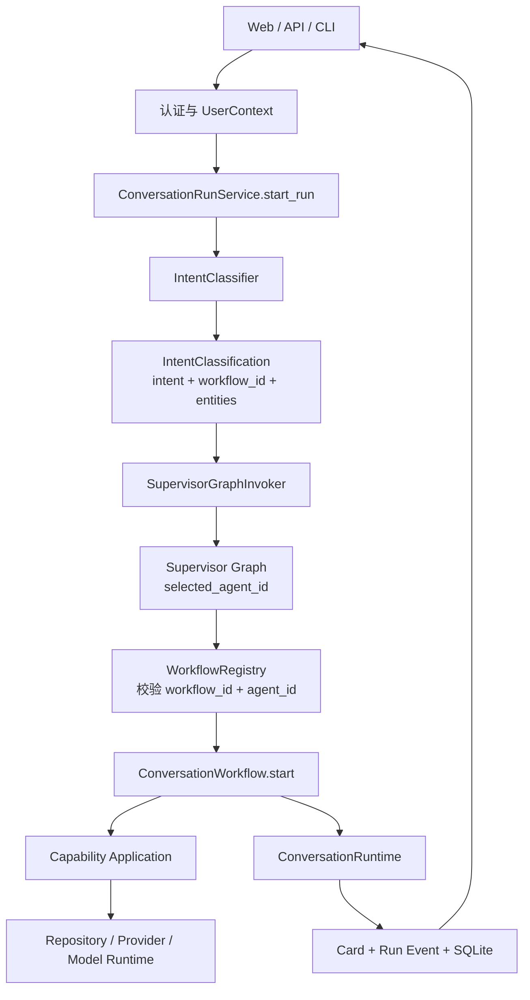
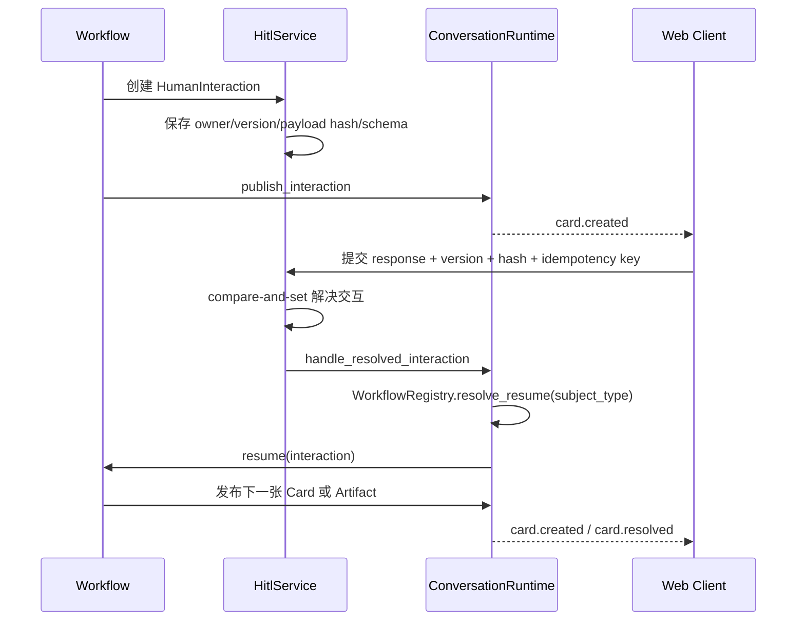

# 系统主流程与模块职责

## 1. 核心结论

系统只有一条会话主流程：API 或 CLI 把请求交给 `ConversationRunService`，分类器返回
结构化路由，Supervisor Graph 确认负责的 Agent，`WorkflowRegistry` 同时校验
`workflow_id` 与 Agent ID，最后由注册的 Workflow 调用 capability。Graph 之后不存在
第二套独立业务路由。

`Workflow` 不是 Journey，也不表示产品旅程。它是一个可注册的应用用例插件，负责：

- 声明稳定 `workflow_id` 和负责它的 `agent_id`；
- 使用分类器已经提取的结构化实体启动用例；
- 声明自己创建的 HITL `subject_type`，并在人工响应后恢复；
- 调用 capability application，生成或投影 Card，不解析自然语言。

新增业务流程时，应新增 Workflow 并在组合根注册。不得修改通用会话入口来增加
自然语言 `if/elif`、固定证券、固定用户或固定模型判断。

## 2. 一次请求如何执行



具体顺序如下：

1. API 认证请求并生成 `UserContext`，`owner_id` 成为资源隔离键。
2. `ConversationRunService` 创建 `run_id`，绑定 owner-scoped thread，并持久化用户消息。
3. `IntentClassifier` 只返回 `IntentClassification`；自然语言规则或 LLM prompt 位于其
   可替换实现中，不进入会话运行时。
4. `SupervisorGraphInvoker` 显式适配 LangGraph。Graph 校验 `AgentState`、选择 Agent，
   并执行通用策略门禁。
5. `WorkflowRegistry.resolve_start()` 要求分类结果的 `workflow_id` 与 Graph 返回的
   `selected_agent_id` 同时匹配。不一致、未知或缺失时安全关闭。
6. Workflow 使用 `WorkflowStartContext` 中的结构化实体调用 capability application。
7. capability 执行领域规则；外部数据、数据库和专用模型只能通过 port/adapter 访问。
8. `DefaultWorkflowRuntime` 持久化 Card、artifact、run context、事件和恢复收据。

当前 Supervisor 的 `execute_command` 与 `render` 节点仍保持轻量骨架。已实现的业务纵切面
由注册 Workflow 调用确定性 application service 推进；Graph 负责唯一 Agent 路由与
通用策略门禁，不在节点中重复实现领域状态机。

## 3. HITL 如何暂停和恢复



HITL 是后端持久化协议，不只是前端弹窗。`HumanInteraction` 保存 owner、run、subject
版本、payload hash、响应 schema、截止时间和最终处理结果。刷新、重复点击或进程重启
不会绕过审批：恢复结果保存在 SQLite 收据中，同一交互只会成功推进一次。

## 4. 各顶层包负责什么

| 包 | 职责 | 不允许做的事 |
| --- | --- | --- |
| `core` | AgentState、LLM、Tool、HITL、Card、Event、安全等跨业务协议 | 导入 capability、adapter 或具体业务流程 |
| `agents` | Supervisor 和 Research/Strategy/Planning manifest、prompt、subgraph | 直连 repository/provider；实现量化算法 |
| `capabilities` | 市场研究、量化、watchlist、策略、计划、提醒的领域规则与用例 | 依赖某个具体数据库/模型厂商；跨 capability 读取内部模块 |
| `adapters` | SQLite、LiteLLM、行情 provider、LightGBM/LSTM、OIDC、通知实现 | 决定业务流程或绕过 port 调用领域内部对象 |
| `apps` | API/CLI/worker 入口、composition root、Graph adapter、Workflow 装配 | 在通用入口解析自然语言或枚举具体业务分支 |
| `web` | Chat 时间线、白名单 Card renderer、HITL response、SSE 恢复 | 把按钮点击直接当作业务成功；执行服务端未声明动作 |

每个 capability 内部目录含义一致：

| 子包 | 职责 |
| --- | --- |
| `domain` | entity、value object、状态机和不变量 |
| `application` | command/query 用例编排、幂等和事务边界 |
| `ports` | repository、provider 或 model runtime 所需接口 |
| `tools` | Agent 调用 application 的薄适配器和 schema |
| `cards` | 领域结果到版本化 Card 的确定性投影 |
| `contracts.py` | 允许其他模块引用的稳定公开类型 |

Capability 是完整业务模块；Tool 只是 Agent 进入 capability 的受控入口。API、CLI 和
worker 可以直接复用 application service，不需要伪装成 Agent，也不允许 Tool 调用 Tool。

## 5. Agent、LLM 与专用量化模型

首版只有 Research、Strategy 和 Planning 三类业务子智能体。Quantitative 不是 Agent：

```text
Research / Strategy Agent
  -> ToolGateway
  -> quantitative Tool
  -> quantitative application
  -> approved model registry
  -> LightGBM / 可选 LSTM runtime
  -> 持久化 prediction 或 scan result
  -> LLM 只读总结
```

LiteLLM adapter 实现供应商无关的 `LLMClient`，负责 route、结构化输出、预算、重试、
fallback 和错误归一化。LLM 可以做意图分类、总结、解释和草稿，但不能生成或覆盖价格
预测、概率、分数、排序和 model lineage。

## 6. 什么是协议常量，什么是业务写死

允许保留并必须版本化管理的值包括：`workflow_id`、Agent ID、Tool ID、Card kind、event
type、schema version、领域状态和仅支持美股的市场边界。后端、数据库和前端依靠这些值
互操作；把它们改成自由文本会破坏协议。

禁止进入通用运行时的写死内容包括：

- “买”“研究”“新增一个交易”等自然语言短语判断；
- 固定证券、用户、租户、模型版本、策略版本或伪造来源关系；
- 用户可见标题、默认表单值、提醒渠道和 provider 地址；
- 根据异常消息、Card 文案或 LLM 自由文本决定控制流。

这些内容分别属于分类 adapter、Workflow/capability、类型化配置或测试 fixture。生产组合
根缺少必需配置时必须失败关闭，不能回退到隐藏业务默认值。

## 7. PyCharm 导航

核心 Protocol 的正式实现使用显式继承，例如：

- `GraphInvoker -> SupervisorGraphInvoker`
- `ConversationRuntime -> DefaultWorkflowRuntime`
- `LLMClient -> LiteLLMClient / FakeLLMClient`
- `ToolGateway -> DefaultToolGateway / FakeToolGateway`
- `HitlRepository -> SQLiteHitlRepository`
- `CapabilityRepository -> SQLiteAggregateRepository / InMemoryAggregateRepository`

`tests/architecture/test_protocol_navigation.py` 会检查这些继承关系，防止后续退回只有
结构兼容但 IDE 无法发现实现的隐式鸭子类型。若所有 `trade_agent` 导入仍显示红线，需
将项目 `.venv` 设为解释器，并把 `src/` 标记为 PyCharm 的 Sources Root。
